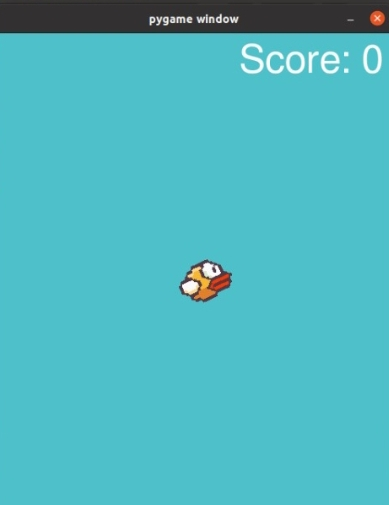
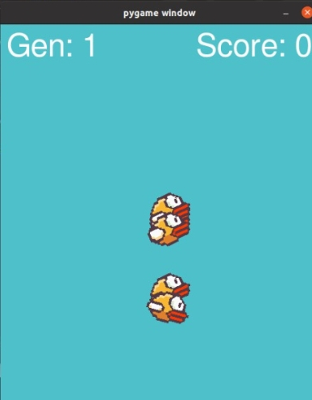

# flappy_python_AI
A model of the Flappy Bird game where you can choose if you'll play or a A.I will play

# How to start the game:

First, on your command prompt,in the directory where the file is, type:"pip install -r requirements.txt" to install the dependencies, after that, type:"python main.py", so you need to select a model of the game for begin.

# Single Player Mode:

If you choose the single player mode, then you'll se a unique bird that you can control pressing the space key:

When you lose, the game closes.

# A.I Mode:

In this mode, we have so many birds learning how to play the game until become immortal, something like this:

On the side of the score, we have the generation, who shows who generation of birds is playing in that moment, searching for the best bird to become immortal.
If all birds in the generation lose, then a new generation starts.
